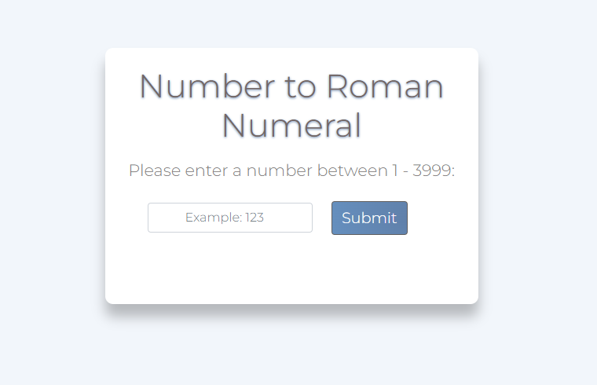
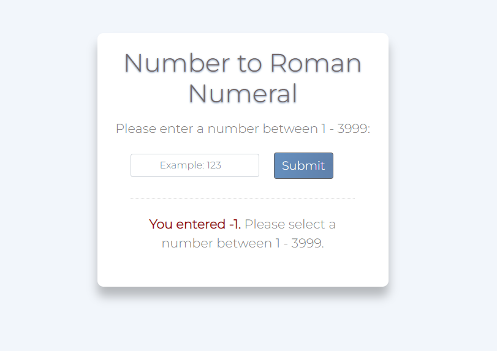
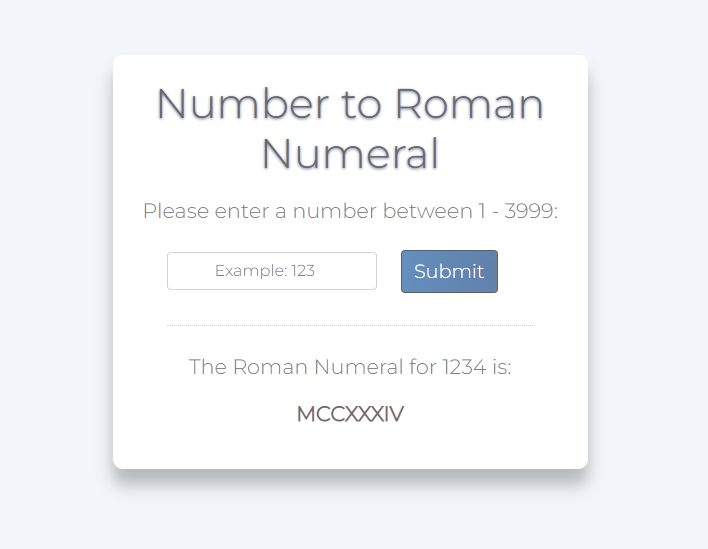

# Number to Roman Numeral Generator

A web-based application featuring a number to roman numeral generator. Built with JavaScript, Bootstrap, and CSS. 

## Project Screen Shots

Number to Roman Numeral Generator Start Screen

To start, please enter a number between 1 and 3999 in the input box.

Error Checking

If you have entered a number outside of the range of 1 - 3999, an error message will display.

Successful Result Display

If you have successfully entered a number between 1 and 3999, the roman numeral equivalent will display.

## Launch Instructions

Clone this repository to your local machine. 

Double click on the index.html file. The application will launch in your web browser.

**Please note that this application requires an internet connection.  

## Reflection

I built this mini-project after completing Leetcode's Integer to Roman question, located at: https://leetcode.com/problems/integer-to-roman/. It was a great introductory project to practice the fundamentals of JavaScript and CSS.
